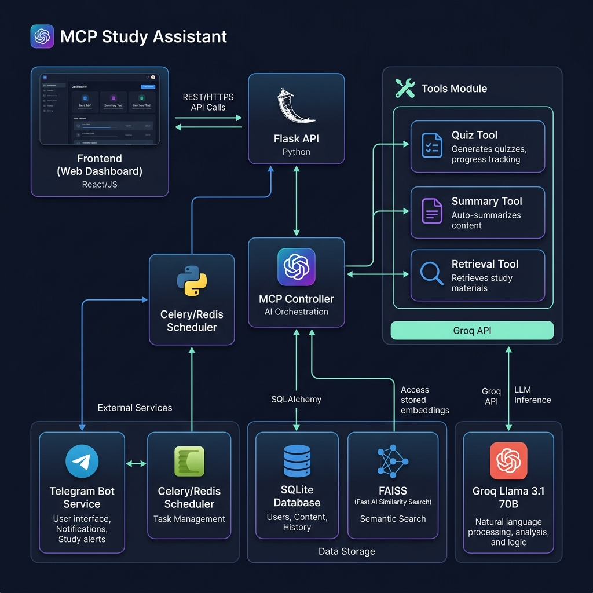

# 🎓 MCP Study Assistant



An intelligent, AI-powered study platform built on the **Model Context Protocol (MCP)** architecture. Transform your PDFs into interactive learning materials, generate quizzes, and get instant summaries via a sleek, modern dashboard or Telegram.

---

## 🚀 Features

| Feature | Description |
| :--- | :--- |
| **📄 Smart PDF Processing** | Upload PDFs and extract content using advanced OCR and text extraction. |
| **🧠 RAG-based Q&A** | Ask questions about your documents and get context-aware answers powered by Llama 3.1 & Groq. |
| **📝 Auto-Quiz Generation** | Instantly create Multiple Choice Questions (MCQs) from your study materials. |
| **📊 Study Dashboard** | Manage course materials, track interaction history, and review previous topics. |
| **🤖 Telegram Integration** | Receive daily study topics and summaries directly on your phone. |
| **🔐 Secure Auth** | User signup and login with bcrypt password hashing. |

---

## 🛠️ Tech Stack

- **Backend**: Python, Flask, Groq API (Llama 3.1)
- **Frontend**: HTML5, Vanilla CSS, Lucide Icons, Marked.js
- **Database**: SQLite (Local storage for users, docs, and history)
- **Vector Search**: FAISS (Facebook AI Similarity Search)
- **OCR/PDF**: PyMuPDF, pdf2image, pytesseract
- **Services**: Telegram Bot API, APScheduler

---

## ⚙️ Installation & Setup

### 1. Clone the Repository
```bash
git clone https://github.com/arunsrinivas07/mcp-project.git
cd mcp-learning-assistant
```

### 2. Install Dependencies
Ensure you have Tesseract OCR installed on your system, then install Python packages:
```bash
pip install -r requirements.txt
```

### 3. Configure Environment Variables
Create a `.env` file in the root directory (refer to `.env.example`):
```env
GROQ_API_KEY=your_groq_api_key_here
BOT_TOKEN=your_telegram_bot_token_here
```

### 4. Database Setup
The application uses SQLite. Parent directories for data storage are created automatically.

---

## 🏃 How to Run

### Start the Flask Server
```bash
python run.py
```
The server will run on `http://127.0.0.1:5000`.

### Start the Telegram Service (Optional)
```bash
python services/telegram_service.py
```

### Access the Web UI
Open `frontend/index.html` in your browser or serve it via a live server.

---

## 📁 Project Structure

```text
mcp-learning-assistant/
├── api/                # Flask API endpoints & App logic
├── core/               # Core engine (LLM, RAG, PDF processing)
├── data/               # Persistent storage (Database & Vector Index)
├── frontend/           # Web interface (HTML/CSS/JS)
├── mcp/                # MCP Tools and Controller logic
├── services/           # Background services (Telegram, Scheduler)
├── run.py              # Main entry point
└── requirements.txt    # Project dependencies
```

---

## 📖 Usage Guide

1. **Upload**: Use the "Process New PDF" button to upload your lecture notes or textbooks.
2. **Interact**: Use the chat interface to ask questions like *"Explain the concept of backpropagation in simple terms."*
3. **Learn**: Click "Create Quiz" to generate interactive MCQs and test your knowledge.
4. **Review**: Check the "History" tab to see all your previous interactions.
5. **Mobile**: Connect your Telegram Bot to get daily study nudges.

---

## 🤝 Contributing

Contributions are welcome! Please feel free to submit a Pull Request.

---

## 📄 License

This project is licensed under the MIT License.